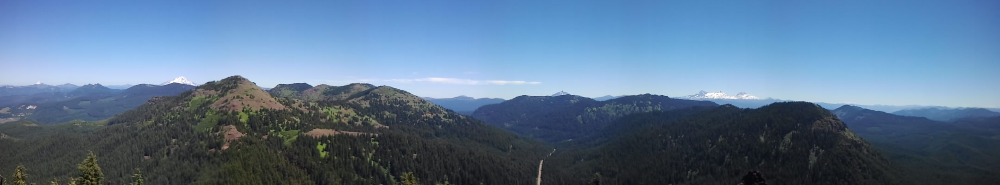
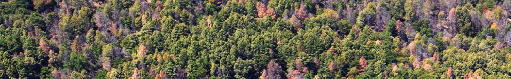
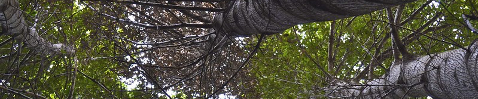

<head>
<!-- Global site tag (gtag.js) - Google Analytics -->
<script async src="https://www.googletagmanager.com/gtag/js?id=UA-44627976-8"></script>
<script>
  window.dataLayer = window.dataLayer || [];
  function gtag(){dataLayer.push(arguments);}
  gtag('js', new Date());

  gtag('config', 'UA-44627976-8');
</script>
</head>

```{r setup, include=FALSE}
knitr::opts_chunk$set(echo = TRUE)
```

```{r include=FALSE}
library(git2r)
library(tidyverse)
library(knitr)
library(kableExtra)
repo <- repository()
```




# Welcome

Welcome to the webpage for the *Forest Health Citizen Science Community*. The sole purpose of this page is to share information relevant to the community by the community.

## Join the Community {.tabset .tabset-fade}

Anyone working in the space between forest health and society is welcome to join.

### Mailing List

Subscribe to the [mailing-list](https://groups.io/foresthealthcitsci) by visiting the [Groups.io page (https://groups.io/g/ForestHealthCitSci)](https://groups.io/g/ForestHealthCitSci) or by emailing the subscribe email listed below: 

* Group Email Addresses
  +  Post: ForestHealthCitSci@groups.io
  +  Subscribe: ForestHealthCitSci+subscribe@groups.io
  +  Unsubscribe: ForestHealthCitSci+unsubscribe@groups.io
  +  Group Owner: ForestHealthCitSci+owner@groups.io
  +  Help: ForestHealthCitSci+help@groups.io
  
Note that you do *not* need a groups.io account to subscribe.

### Slack Workspace

You can join our [Slack Workspace](https://foresthealthcitsci.slack.com) at this temporary [link](https://join.slack.com/t/foresthealthcitsci/shared_invite/enQtNzk3MDg0NTk2NDY0LTI4MDQ4OGIxMWJjODdlYjczODhkOTQ2ODE2Y2FiOTQ4ZDgxMTI3YmY5ZTVlMmY1MGQxZTUwMWNhODZiNzQwYjk). However, the invitation in the link will expire on November 14, 2019.

Please contact <ForestHealthCitSci@gmail.com> to join the discussion if the link has expired. 

Note that you need a Slack account to join the Slack Community.

### Github Repository 

This webpage and the project list below are hosted in a [github repository](https://github.com/jmhulbert/fhcs). 

Anyone is welcome to collaborate to add or make changes to the [github repository (https://github.com/jmhulbert/fhcs)](https://github.com/jmhulbert/fhcs). The content on this page is compiled using R Markdown, but the project list is maintained as a [.csv file](https://github.com/jmhulbert/fhcs/blob/7abe537b37548a2aa3f0cffe2a85c6763f559be1/files/data/ProjectList.csv).

Note that you need a github account to collaborate or make changes. Feel free to contact <ForestHealthCitSci@gmail.com> for additional details or instructions. 

* As a respository collaborator:
    + You are welcome to clone the repository to your system and work from the R Project (*fhcs.Rproj*) file in Rstudio or you can make changes to the *ProjectList.csv* file. 
    + You can also make changes directly to the .csv file through your browser.
    + Or you can make changes by downloading the .csv file, altering, commiting and pushing it back to the repository.

*Note that the Markdown (index.Rmd) file will need to be knit before the changes will be visible on this webpage.*

##
{width=100%}

## List of Forest Health Citizen Science Projects

> **Have a project to add to this list?** *Share it with the community (ForestHealthCitSci@groups.io), add it to the [.csv file](https://github.com/jmhulbert/fhcs/blob/7abe537b37548a2aa3f0cffe2a85c6763f559be1/files/data/ProjectList.csv), or email the details to <ForestHealthCitSci@gmail.com>.* 

```{r echo=FALSE}
ProjectList <- read.csv("./files/data/ProjectList.csv")
```

The projects below are listed alphabetically. There are currently `r length(ProjectList$Project)` projects listed below. Email <ForestHealthCitSci@gmail.com> for corrections.
```{r echo=FALSE}
kable(ProjectList,align="c") %>% kable_styling(c("striped", "hover", "condensed", "responsive",full_width=F)) %>% scroll_box(width = "95%", height = "700px") #valign?
```

You can cite this table as: Hulbert J, Barton M, Castagneyrol B, Oraizo C,  Rosemartin A. `r format(Sys.Date(), "%Y")`. “Forest Health Citizen Science Project List” FHCS. Commit ID:`r str_trunc(as.data.frame(last_commit(repo))[[1]],6,ellipsis ="")`,  https://github.com/jmhulbert/fhcs. Updated: `r format(Sys.Date(), "%B %e, %Y")`.

```{r include=FALSE}
commits(repo)[[1]]
last_commit(repo)
as.data.frame(last_commit(repo))
str_trunc(as.data.frame(last_commit(repo))[[1]],6,ellipsis = "")
```

Currently the individuals who shared projects in the Google form are listed as authors. Anyone is welcome to add to the project list or be included in the citation. Collaborators in the [github repository](https://github.com/jmhulbert/fhcs) will also be added to the citation.

{width=100%}

## Community Publications
(more coming soon) 

> **Have publications or articles to share here?** *Share them with the community (ForestHealthCitSci@groups.io), add them to the [Github Repository](https://github.com/jmhulbert/fhcs), or email the details to <ForestHealthCitSci@gmail.com>.*

* Peer-reviewed publications (listed by publication year)
    + Thomas, M. L., N. Gunawardene, K. Horton, A. Williams, S. O’Connor, S. McKirdy, and J. van der Merwe. 2017. *Many eyes on the ground: citizen science is an effective early detection tool for biosecurity*. [Biological Invasions 19:2751–2765](https://link.springer.com/article/10.1007/s10530-017-1481-6).
    + Brown, N., F. van den Bosch, S. Parnell, and S. Denman. 2017. *Integrating regulatory surveys and citizen science to map outbreaks of forest diseases: acute oak decline in England and Wales*. [Proceedings of the Royal Society B: Biological Sciences 284:20170547](https://royalsocietypublishing.org/doi/full/10.1098/rspb.2017.0547).
    + Bates, A. J., P. Lakeman Fraser, L. Robinson, J. C. Tweddle, J. P. Sadler, S. E. West, S. Norman, M. Batson, and L. Davies. 2015. *The OPAL bugs count survey: exploring the effects of urbanisation and habitat characteristics using citizen science*. [Urban Ecosystems 18:1477–1497](https://link.springer.com/article/10.1007/s11252-015-0470-8).
    + Meentemeyer, R. K., M. A. Dorning, J. B. Vogler, D. Schmidt, and M. Garbelotto. 2015. *Citizen science helps predict risk of emerging infectious disease*. [Frontiers in Ecology and the Environment 13:189–194](https://esajournals.onlinelibrary.wiley.com/doi/abs/10.1890/140299).
    + Ingwell, L. L., and E. L. Preisser. 2011. *Using citizen science programs to identify host resistance in pest-invaded forests*. [Conservation Biology 25:182–188](https://conbio.onlinelibrary.wiley.com/doi/abs/10.1111/j.1523-1739.2010.01567.x).
    + **Your publications here.**

* Online reports
    + Gupta, N., and Slawson, D., 2019. *Tree Health Citizen Science in UK: Opportunities, Challenges and Future Roadmap.* [Imperial College, London](https://www.imperial.ac.uk/media/imperial-college/faculty-of-natural-sciences/centre-for-environmental-policy/public/THCS-in-the-UK---Opportunities-,-Challenges-and-Future-Roadmap---Defra-Report-September-2019.pdf).
    + **Your reports here.**

* Popular articles (written by community members)
    + Garbelotto M. 2019. [Citizen science making a difference for California](https://www.dailycal.org/2019/10/04/citizen-science-making-a-difference-for-california/)
    + Hulbert J, Roets F. 2017. [Citizen science: how ordinary people can guard Cape Town’s biodiversity](https://theconversation.com/citizen-science-how-ordinary-people-can-guard-cape-towns-biodiversity-87373)
    + **Your articles here.**
